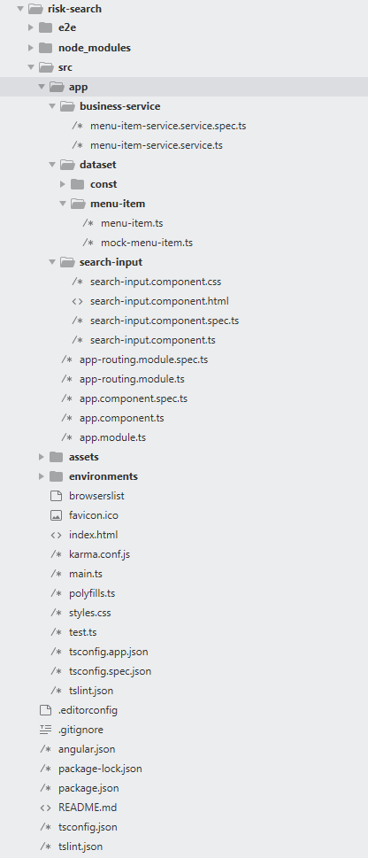

**<font color="#5A5AAD">Nothing is impossible, the word itself says "I'm possible"!</font>**

## <font color="#FF5151">Build your first angular program: </font>使用angular构建你的前端项目。
<font style="color: #394F6A; font-size: 20px; font-family: '微软雅黑'">[主要语言] typescript/html/css</font>

<!--more-->

### 安装angular

首先你需要安装node环境，至于安装方式这里不再赘述，我们的内容从nodejs安装完成后的sass安装开始:

> npm install -g @angular/cli     （windows）

### 创建项目

> ng new angular-tour-of-heroes

### 开启ng服务

> cd angular-tour-of-heroes
> ng serve --open

#### 业务需要使用tree导航栏，我选择

```
npm install --save @angular/material @angular/cdk @angular/animations
```

将模块添加进项目

```
ng add @angular/material
```

#### 增加ng-alain 为了loading

```
ng add ng-alain
```


*最终上面两个我都没用，我采用了primeng(冷...)*


项目里安装

```
npm install primeng --save
npm install primeicons --save
```

[摘抄一个关于ng-alain脚手架的模块规范](https://github.com/ng-alain)

**一直以来 AppModule、CoreModule、SharedModule 模块使用没有很明确的规范，很容易让产生乱用。Angular模块目标是为了使组件、指令、服务和管道功能块更内聚，并每一个功能区域形成独立的业务领域或实用工具的集合。**

##### AppModule

根模块，用于引导 Angular 启动；它非常适合导入一些需要在整个应用到处需要的模块，例如：主题系统、用户主认证模块、权限模块等模块，以及一些全局性HTTP拦截器、国际化服务等。

##### CoreModule

核心模块只会被导入一次，它等同 AppModule，但我们更应该把它当成一个纯服务类模块，例如：消息、数据访问等。

##### SharedModule

我们叫它共享模块；它不应该出现 providers，因为 ShareModule 会在所有业务模块中被导入，这会导致服务被覆盖。

而特殊的，在angular官网里提到:

> 坚持把数据操作和与数据交互的逻辑重构到服务里。
> 坚持让数据服务来负责 XHR 调用、本地储存、内存储存或者其它数据操作。

所以，比如关于http请求获取数据，两个原则会有轻微冲突，这个应该写入业务里还是写入服务里，大家可以根据自己的业务复杂度选择。

我的选择是写入服务里，遵循angular的原则。

**下图所示:我的简单项目demo结构为**


